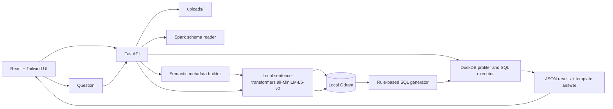

# Chat with Dynamic Parquet Files

A fully local AI-powered parquet analytics application. Users upload one or many parquet files from the UI, the backend detects each schema dynamically, creates local semantic embeddings with `all-MiniLM-L6-v2`, stores metadata vectors in local Qdrant, generates SQL with schema-aware rules, runs it in DuckDB, and returns an explainable analytics response.

No OpenAI APIs, no Ollama, no cloud LLMs, and no paid AI services are required.

## Architecture



## Folder Structure

```text
backend/
  api/routes/          FastAPI endpoints
  core/                settings
  duckdb/              parquet profiling and SQL execution
  embeddings/          local sentence-transformers wrapper
  metadata/            dynamic semantic metadata generation
  qdrant/              local vector database integration
  retrieval/           question-to-metadata semantic search
  services/            ingestion/query orchestration
  spark/               optional local Spark schema reader
  sql_generation/      rule-based dynamic SQL generator
frontend/
  src/components/      enterprise UI panels
  src/pages/           analytics workbench
  src/services/        API client
uploads/               user-uploaded parquet files
```

## What It Does

- Uploads one or many `.parquet` files from the browser.
- Saves uploads locally under `uploads/`.
- Detects columns, datatypes, row count, sample rows, and profile stats dynamically.
- Uses DuckDB as the primary local execution engine.
- Uses Spark locally for schema validation when Java/Spark are available.
- Generates semantic metadata from column names, normalized labels, sample values, datatypes, and profile stats.
- Creates embeddings locally with `sentence-transformers` and `all-MiniLM-L6-v2`.
- Stores semantic metadata in local Qdrant.
- Matches natural language questions to relevant uploaded-file metadata.
- Generates SQL dynamically without hardcoded schemas.
- Executes SQL against the uploaded parquet file with DuckDB.
- Shows semantic matches, generated SQL, matched columns, and result rows in the UI.

## Prerequisites

- Python 3.11 or 3.12 recommended
- Node.js 20+
- Docker Desktop if you prefer standalone Qdrant server mode
- Java 8/11/17 if you want Spark schema inspection enabled

The embedding model may download once from Hugging Face the first time it is used. After that, it runs from the local model cache. To run in a locked-down environment, pre-download the model and set `EMBEDDING_MODEL` to the local model folder.

## PowerShell Setup

Run from the project root:

```powershell
python -m venv .venv
.\.venv\Scripts\Activate.ps1
python -m pip install --upgrade pip
pip install -r requirements.txt
```

By default, the backend uses Qdrant embedded local mode and stores vectors under `backend/storage/qdrant/`, so Docker is not required for development.

Start the backend:

```powershell
uvicorn backend.main:app --reload --host 0.0.0.0 --port 8000
```

Start the frontend in a second PowerShell window:

```powershell
cd frontend
npm install
npm run dev
```

Open:

- UI: `http://localhost:5173`
- Swagger docs: `http://localhost:8000/docs`
- Health check: `http://localhost:8000/health`
- Qdrant dashboard: `http://localhost:6333/dashboard` when using server mode

## Qdrant Docker

`docker-compose.yml` starts Qdrant locally on port `6333` and persists vectors under `qdrant_storage/`. Use this when you want the standalone Qdrant service instead of embedded local mode.

```powershell
$env:QDRANT_MODE="server"
docker compose up -d qdrant
docker compose logs -f qdrant
docker compose down
```

## API Documentation

### `GET /health`

Returns service status, embedding model, and Qdrant URL.

### `POST /api/files/upload`

Single-file multipart upload endpoint.

Form field:

- `file`: any `.parquet` file

Returns:

- dataset id
- filename
- row count
- columns and datatypes
- sample rows
- Spark schema availability
- semantic metadata count

### `POST /api/files/upload-multiple`

Multi-file multipart upload endpoint used by the UI.

Form field:

- `files`: one or more `.parquet` files

Returns:

- `datasets`: successfully indexed parquet datasets
- `errors`: per-file processing errors, if any

### `GET /api/datasets`

Lists uploaded datasets with their detected schema manifests.

### `GET /api/datasets/{dataset_id}/schema`

Returns the full manifest for one uploaded parquet file.

### `POST /api/chat/query`

Request:

```json
{
  "dataset_id": "uploaded_dataset_id",
  "question": "Which area has highest electricity usage?",
  "limit": 100
}
```

Returns:

- template answer
- Qdrant semantic matches
- generated SQL
- selected metric/grouping columns
- DuckDB result rows

### `POST /api/chat/query-all`

Queries across all uploaded parquet datasets, or a supplied subset of dataset ids.

The backend:

- searches Qdrant metadata across selected datasets
- creates DuckDB views for every selected parquet
- infers joins from matching columns and foreign-key style names such as `EquipmentId`, `DeviceLocationId`, `ConsumerID`, `Material_ID`, and `HES_ID`
- generates joined SQL, grouped SQL, trend SQL, outlier SQL, or per-dataset row counts
- returns generated SQL and result rows

## Dynamic SQL Examples

Question:

```text
Which area has highest electricity usage?
```

The system embeds the question, retrieves relevant metadata, chooses numeric and grouping columns from the uploaded schema, and generates SQL shaped like:

```sql
SELECT
  "Region" AS "Region",
  MAX("Power_Consumption") AS metric_value
FROM dataset
WHERE "Power_Consumption" IS NOT NULL AND "Region" IS NOT NULL
GROUP BY "Region"
ORDER BY metric_value DESC
LIMIT 100
```

Question:

```text
Show regions with abnormal consumption.
```

The rule engine generates a local z-score query against the selected metric column.

## Environment Variables

Create `.env` in the project root if needed:

```env
QDRANT_MODE=embedded
QDRANT_URL=http://localhost:6333
QDRANT_COLLECTION=parquet_semantic_metadata
EMBEDDING_MODEL=all-MiniLM-L6-v2
ENABLE_SPARK_SCHEMA=true
```

For offline model usage:

```env
EMBEDDING_MODEL=D:\models\all-MiniLM-L6-v2
```

## Demo Flow

1. Start the backend and frontend. Start Docker Qdrant first only if using `QDRANT_MODE=server`.
2. Upload any parquet file from the UI.
3. Confirm row count, schema, datatypes, and sample rows.
4. Ask a natural language question.
5. Review semantic matches in the debug panel.
6. Review generated SQL.
7. Confirm DuckDB results in the table.

## Notes

- There are no sample parquet generation scripts.
- There are no predefined parquet filenames.
- There are no hardcoded table schemas.
- The SQL generator is intentionally rule-based for explainability and local operation.
- Future LLM integration can be added behind the same `sql_generation` interface without changing upload, metadata, retrieval, or execution flows.
- For a file-by-file implementation guide and troubleshooting playbook, read `README-Guide.md`.
- For Swagger endpoint details and API testing steps, read `README-API-Swagger.md`.
# Parquet-AI
